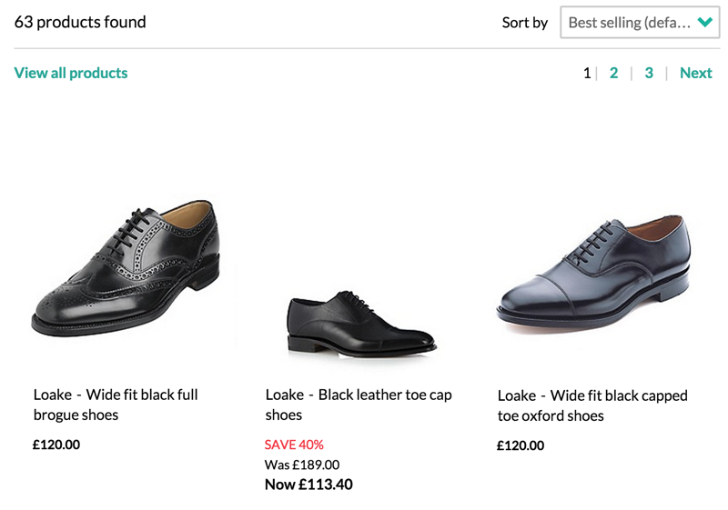

# Online Shopping System

## Category Listing Page



+ IT should display the number of products found

Products found comes from the Category Listing API. An example of this looks like the following:

```
{
    totalItems: 56,
    products: [
        {
            maker: {
                id: "324"
                title: "Loake"
            },
            title: "Black leather toe cap shoes",
            price: 11340,
            thumbnail: "/is/image/084010360260?$PSPNew$"
        }
    ]
}
```

*Product object notes:*

| Field  | Type  |  Notes |
|---|---|---|
|  Title | String |  Main Title |
|  Maker | Object  | Name is retrieved from the title property  |
|  Price | Integer  | Price is in Pence  |

### Product

+ IT should display a thumbnail 
+ IT should display the product name 
+ IT should display the price

#### Sale Item

+ IT should display the original price
- IT should prepend the price with Now
+ IT should display the discount as a percentage
  - eg 40% off